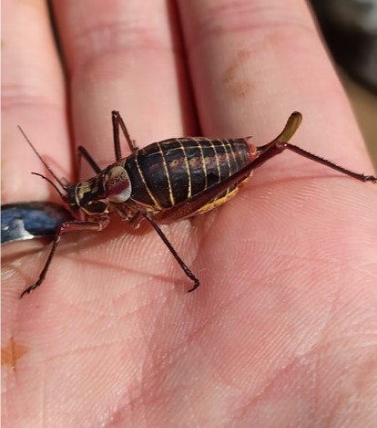
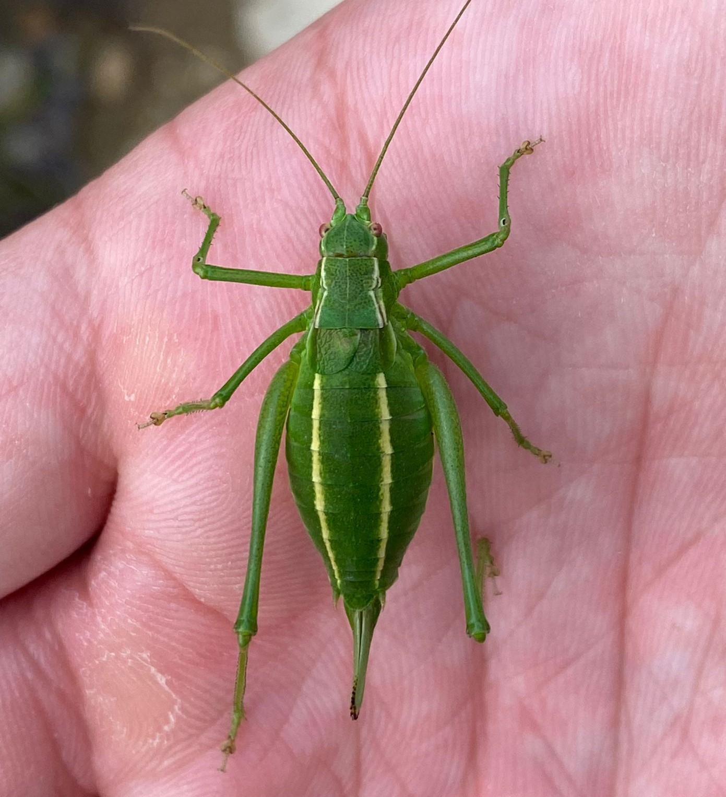

# Population Genetics and Evolutionary Insights of the Endemic Species, *Isophya rizeensis* Bush Cricket.

<table>
  <tr>
    <td>
      
      <br><b>Figure 1a:</b> Dark-colored individual of Isophya rizeensis from 450 meters.
    </td>
    <td>
      
      <br><b>Figure 1b:</b> Green-colored individual of Isophya rizeensis from 2100 meters.
    </td>
  </tr>
</table>

Outline
- [Study Summary](https://github.com/UfukTopalan/RAD-Seq-data-analysis/blob/main/Methods.md#study)
- [Alignment](https://github.com/UfukTopalan/RAD-Seq-data-analysis/blob/main/Methods.md#alignment-with-bwa)
- [Paralog Elimination](https://github.com/UfukTopalan/RAD-Seq-data-analysis/blob/main/Methods.md#eliminating-paralogs)
- [Filtering High Coverage Sites](https://github.com/UfukTopalan/RAD-Seq-data-analysis/blob/main/Methods.md#filtering-only-high-coverage-sites)
- [Variant Calling](https://github.com/UfukTopalan/RAD-Seq-data-analysis/blob/main/Methods.md#genotyping-and-variant-calling)
- [Principal Component Analysis](https://github.com/UfukTopalan/RAD-Seq-data-analysis/blob/main/Methods.md#population-structure-pca)
- [Admixture Analysis](https://github.com/UfukTopalan/RAD-Seq-data-analysis/blob/main/Methods.md#admixture)
- [Discriminant Analysis of Principal Components](https://github.com/UfukTopalan/RAD-Seq-data-analysis/blob/main/Methods.md#discriminant-analysis-of-principal-components-dapc)
- [The Site Frequency Spectrum](https://github.com/UfukTopalan/RAD-Seq-data-analysis/blob/main/Methods.md#the-site-frequency-spectrum-sfs)
- [Genetic Differentiation - Pairwise Fst](https://github.com/UfukTopalan/RAD-Seq-data-analysis/blob/main/Methods.md#genetic-differentiation---pairwise-fst)
- [Isolation By Distance](https://github.com/UfukTopalan/RAD-Seq-data-analysis/blob/main/Methods.md#isolation-by-distance-ibd-patterns)
- [GWAS (Genome-Wide Association Study)](
## STUDY

Our research investigates the genetic mechanisms underlying adaptations in Isophya rizeensis, a univoltine bush cricket species that exhibits notable color polymorphism across its altitudinal range. At lower altitudes, up to 1100 meters, populations consist primarily of dark-colored individuals, while at altitudes above 1100 meters, green-pale individuals dominate. This species thrives across a broad range, from sea level to 2400 meters, facing varying environmental conditions, particularly temperature and precipitation fluctuations associated with altitude.  Our study aims to uncover how these populations adapt through genetic differentiation and the identification of SNPs associated with color polymorphism.

To accomplish this, we analyzed genome-wide polymorphisms in 71 individuals across 11 subpopulations using RAD sequencing data. Employing methods such as Principal Component Analysis (PCA), Admixture, Snmf, and Fst analyses, we examined genetic differentiation between populations. Additionally, Discriminant Analysis of Principal Components (DAPC) helped identify specific genetic loci associated with altitudinal variation. Given the lack of a reference genome for this species or any closely related species, we used a de novo set of RAD contigs discovered in the CAYMY population of I. rizeensis as an outgroup and reference genome for alignment.

This research enhances our understanding of the evolutionary dynamics and adaptive mechanisms in response to altitude-related environmental factors and color polymorphism, contributing valuable insights to the field of biodiversity research.

## Data Manipulation 

First, we need to create list files for both individuals and populations. You can use the following commands:

```bash
# Create a list of individuals
ls *.fastq.gz | cut -d'_' -f1-2 > isophya.list

# Extract unique population identifiers from the list
cut -c3-5 isphya.list | uniq > pop11_list
```
## Alignment with BWA
### Alignment and Processing
In our analysis, we utilize a series of tools to align sequencing reads and process the resulting BAM files:

- BWA-MEM: The BWA-MEM algorithm is employed to align sequencing reads to a reference genome. It is well-suited for handling long reads and provides accurate alignments by performing local alignment. This algorithm uses a seed-and-extend approach, which enhances its sensitivity to correctly align reads that span across large regions of the genome.

- Samtools: Post-alignment, Samtools is used to process the BAM files. It performs tasks such as sorting the aligned reads and filtering to retain only properly paired reads. This ensures that the data is of high quality and ready for further analysis.

- Picard: The Picard tool is used to mark duplicate reads in the BAM files. Identifying duplicates is important for reducing biases that may arise during sequencing and ensuring the accuracy of subsequent analyses.

Before running the alignment script, we must index our reference genome.
```bash
~/bin/bwa/bwa index -a bwtsw ~/isophya/references/isophya_contigs_CAYMY.fasta
```

We use this [script](scripts_folder/alignment.sh) for aligning sequencing reads to a reference genome using BWA and processing the resulting BAM files with Samtools and Picard. To run the script, use the following command:

```bash
sbatch align_pe_reads.sh ~/isophya/raw/isphya.list ~/isophya/references/isophya_contigs_CAYMY.fasta
```
Now that we have 71 BAM files at low/medium depth, we can create a BAM list for the dataset as a whole, and also for each subpopulation to use in downstream analysis.

```bash
ls ~/isophya/*_sorted_mdup.bam > isophya71.bamlist
for i in cat pop11_list; do grep $i isophya71.bamlist > ${i}.bamlist; done
```

For understanding the samtools flags, you can refer to their official documentation at [Samtools Format](https://www.samformat.info/sam-format-flag#google_vignette) ; Let’s check one of the files using the `samtools flagstat` command:
```bash
samtools flagstat CKLYU_010_sorted_mdup.bam
24236 + 0 in total (QC-passed reads + QC-failed reads)
4412 + 0 duplicates
15408 + 0 mapped (63.57%:-nan%)
24236 + 0 paired in sequencing
12080 + 0 read1
12156 + 0 read2
13148 + 0 properly paired (54.25%:-nan%)
14714 + 0 with itself and mate mapped
694 + 0 singletons (2.86%:-nan%)
1554 + 0 with mate mapped to a different chr
826 + 0 with mate mapped to a different chr (mapQ>=5)
```

Now, to check the stats for all BAM files, you can use a simple script available [here](scripts_folder/count_no_align.sh).
Run the script with the following command:
```bash
sbatch count_no_align.sh
```
With the output, you can review the mapped reads in the third column and filter out any individuals or reads with low quality.


## Eliminating Paralogs

After individual elimination, we can perform filtering for paralog sites. Before doing so, we need to create a position file that contains the positions for all populations. This can be achieved by genotyping all subpopulations and creating a `.mafs` file, then extracting the positions from it.

To genotype all groups, you can use the following [script](scripts_folder/genotyping_groups.sh) You'll need to provide a population list file, which contains all subpopulations, and create a `.bamlist` file for each subpopulation. You will also need to provide a reference FASTA file.

To run the script:

```bash
sbatch genotyping_groups.sh pop11_list ~/references/isophya_contigs_CAYMY.fasta
```
After creating `.mafs` files for each subpopulation, extract the positions and create a `.pos` file with the following code:

```bash
zless CANCK.mafs.gz | cut -f1-2 | sed 1d > CANCK.pos
```
Next, we can filter the paralog sites using the script [here](scripts_folder/get_paralog.sh). Note that the code provided is an example, and you'll need to organize it for your use case. In this example, I have performed it separately for each subpopulation.

To run the script:
```bash
#pop11 list contains my subpopulations names with .bamlist extensions and in that file they have their bam files paths.
sbatch get_paralog.sh pop11_list
```

This process will generate a file with a .paralogs extension. By conducting a Bonferroni correction (0.05 confidence level) on our SNP number, we can compute a chi-square value using [this website](http://courses.atlas.illinois.edu/spring2016/STAT/STAT200/pchisq.html) and set the threshold based on that (df = 1). Paralogs are eliminated if their values are higher than this threshold. 

For example for the CANCK subpopulation:
```bash
less CANCK.paralogs | awk '$5>35.51  {print $1, $2}'> CANCK_paralog.list
awk 'NR==FNR{a[$1,$2]; next} !(($1,$2) in a)' CANCK_paralog.list CANCK.pos > CANCK_sites
```
Now that we have created a sites file for each population, excluding any paralog sites, we can proceed to create a new sites file. In this new file, we will extract the sites present across all populations. Below is an example of how to do this:
```bash
awk 'NR==FNR{a[$0];next} $0 in a' CANCK_sites PLVYL_sites > CANCK_PLVYL.sites
```
To extract the sites across all groups, use a simple [loop](scripts_folder/extract_common_sites.sh):

To run the loop:
```bash
sbatch extract_common_sites.sh
```

We now have a `nonparalog_sites` file.
At this point, we have filtered out paralog sites, but the process isn't finished. We still need to perform further filtering on the data.

### Filtering Only High Coverage Sites
To focus on high coverage sites, specifically those with 6x coverage, we will use the same pop11_list and create a `.mafs` file for each population using the [script](scripts_folder/high_coverage.sh).

To run the script:
```bash
sbatch high_coverage.sh pop11_list
```

After creating `.mafs` files for each population, we will extract the sites and run a loop (remember to update the output file name accordingly) to obtain sites present across all populations. Next, we need to filter for sites that appear in both the 6x coverage sites file and the non-paralogs sites file.

To create our final sites file and index it for genotyping, use the following command:

```bash
awk 'NR==FNR{a[$0];next} $0 in a' 6x_coverage_sites nonparalog_sites > 6cov_nonparalog.sites
angsd sites index 6cov_nonparalog.sites
```

With this final 6cov_nonparalog.sites file, we are now ready to proceed with the genotyping and variant calling processes.

## Genotyping and Variant Calling
Now, variant calling and genotyping are performed using ANGSD, a toolkit designed for analyzing next-generation sequencing data. The process involves identifying genetic variants such as single nucleotide polymorphisms (SNPs) and determining the genotype of individuals at each site across the genome.

ANGSD allows for flexible analysis by calculating genotype likelihoods rather than directly calling genotypes, which is ideal for working with low to medium-depth sequencing data. This method accounts for uncertainty in base calling and sequence quality, providing more robust results when sequencing coverage is limited. The toolkit also calculates allele frequencies across populations, helping to identify polymorphic sites.

Several output formats, such as Beagle, VCF, and PLINK, are supported to enable further analysis using a variety of downstream tools. This flexibility allows for comprehensive population genetics analyses, ensuring accurate and reliable detection of genetic variants within the dataset.

We'll use several filtering options for obtaining only high quality data. To understand and apply the filtering options for your data, you can check [angsd filter section](https://www.popgen.dk/angsd/index.php/Filters).

Now, for calling genotypes on our bamfiles, we must give a bamlist which we've created earlier. Also again, we need to specify the references sequence too. 
The options used for variant calling in ANGSD include `-GL 1` for genotype likelihoods using the SAMtools model, `-doMajorMinor 1` for inferring the major and minor alleles, `-doMaf 1` to calculate minor allele frequencies, `-doGlf 2` for outputting genotype likelihoods in Beagle format, `-doGeno 5` for generating genotype probabilities, `-doBcf 1` to create a BCF file, `-doPost 1` for posterior probability calculations with a cutoff of `-postCutoff 0.95`, filtering by mapping quality (`-minMapQ 10`), base quality (`-minQ 20`), a minimum number of individuals (`-minInd $mInd`), SNP p-value threshold (`-SNP_pval 1e-12`), minor allele frequency (`-minMaf 0.05`), and limiting the analysis to sites from the file `group_coverage/6cov_nonparalog.sites` which we obtain earlier by removing the paralogs and including only has 6x coverage sites.
We can use this [script](scripts_folder/genotype.sh) to obtain all the files above.
To run this code:
```bash
sbatch genotype.sh isophya71.bamlist ~/references/isophya_contigs_CAYMY.fasta
```
We created the beagle file, mafs file, bcf file, geno file and tped file which we'll use all this files for our analysis.

## Population structure (PCA)

To conduct Principal Component Analysis (PCA) with `pcangsd`, we work directly with genotype likelihoods in Beagle format, without calling genotypes. This approach accounts for genotype uncertainty, making it especially suitable for low-depth sequencing data. The command specifies a Beagle file (`${pop}.beagle.gz`) as input and saves the PCA results in the `results_pca` directory. `pcangsd` efficiently computes covariance matrices based on genotype likelihoods and outputs principal components, which can be used to explore genetic structure among populations.
We can use this [script](scripts_folder/get_PCA.sh).
To run it
```bash
sbatch get_PCA.sh isophya71
```
Running the `get_PCA.sh` script generates an output file called `isophya71.cov`, which contains the covariance matrix. This matrix will be used for eigendecomposition to identify and visualize the main axes of genetic variation. The first two principal components (PC axes) can be plotted using an R script [here](scripts_folder/plotPCA.R), and a simple cluster file can be created to label populations with distinct shapes and for dark and pale population using two colors for clear visualization in the plot.

Our `isophya.firtina.valley.tsv` file contains information about individuals' colors, altitudes, body size, and temperature seasonality. We can use this file to create a simple `.clst` file for labeling populations.

**Example of the TSV file:**

| Indv       | Color | Alt   | Bsize | TS   |
|------------|-------|-------|-------|------|
| CANCK_007  | Pale  | 1200  | 0.66  | 77.8 |
| CANCK_00D  | Pale  | 1200  | 0.66  | 77.8 |
| CANCK_010  | Pale  | 1200  | 0.66  | 77.8 |
| CANCK_011  | Pale  | 1200  | 0.66  | 77.8 |

**Creating the `.clst` file:**

```bash
cut -f1 isophya.firtina.valley.tsv | sed 1d | sed 1iFID > FID
cut -f1 isophya.firtina.valley.tsv | sed 1d | cut -c1-5 | sed 1iIID > IID
less isophya/isophya.firtina.valley.tsv | grep -f taken.list | sort -nk3 | cut -f2 > CLUSTER  # Include only selected individuals
paste -d' ' FID IID CLUSTER > isophya71.clst

# To simplify the plot, we can replace IID with numbers for subpopulation labeling:
sed -i 's/ IST06/ 1/g' isophya.firtina71.clst
...
```
Running the R script for PCA plot:
```bash
Rscript plot.PCA.R -i isophya71.cov -c1-2 -a isophya71.clst -o isophya71_pca.pdf
```


## Admixture
Admixture analysis is crucial for understanding the genetic structure and evolutionary history of populations. It allows us to infer the proportion of genetic ancestry from different ancestral populations within each individual or population. This type of analysis helps in identifying the number of distinct genetic clusters (K) that best represent the underlying genetic variation in the dataset. By determining the optimal number of clusters, we can better understand the genetic relationships and historical migrations between populations.

To perform admixture analysis, we use `NGSadmix` with genotype likelihood files to determine the optimal number of genetic clusters (K) within the dataset. In this analysis, we will explore different values for K ranging from 2 to 5 and run the analysis for each K value with 10 replicates.
We will use the previously generated genotype likelihood file, `isophya71.beagle.gz`, as input for NGSadmix. The process involves looping over each K value and running 10 replicates to ensure robustness and accuracy in our results.

You can use this [script](scripts_folder/get_admix.sh) for admixture analysis.
In the script `-K` specifies the number of clusters to test (from 2 to 5).

To run the script:
```bash
sbatch get_admix.sh isophya71 5
```

By executing this analysis, you will generate output files for each K value, which can then be examined to determine the best-fitting model for your data. 

- #### Determine the Best K Value
  After running the analysis, you’ll have output files for each K value. To identify the most suitable K, extract the likelihood values from each run and prepare a file for [Clumpak](https://clumpak.tau.ac.il/bestK.html), which will use Evanno's method ([Evanno et al. 2005](https://onlinelibrary.wiley.com/doi/10.1111/j.1365-294X.2005.02553.x)) to determine the optimal K. 

```bash
cd results_admix
(for log in `ls *.log`; do grep -Po 'like=\K[^ ]+' $log; done) > logfile
(for log in `ls *.log`; do grep -Po 'nPop=\K[^ ]' $log; done) > noK
paste noK logfile > admix_runs_LH.txt
```
Import the formatted logfile into [Clumpak](https://clumpak.tau.ac.il/bestK.html) to find the most likely K value for your subpopulations.

- #### Visualize Admixture Results
  To visualize the results for the best K, create a bar plot using the R script [here](scripts_folder/plot_Admixutre.R). Import the `.qopt` file from the run with the optimal K (in this case, K=2) and an `info file` to label the populations in the plot.
Create the info file using:
```bash
cut -c3-5 isophya71.list | paste - isophya71.list > isophya71.info
```
Plot the results with:
```bash
Rscript plot_Admixture.R isophya71_admix2_run1.qopt isophya71.info
```

## Discriminant Analysis of Principal Components (DAPC)

Discriminant Analysis of Principal Components (DAPC) is employed to identify and visualize the genetic structure of populations by maximizing the separation between pre-defined groups while retaining as much genetic variation as possible. This analysis helps in assessing how well individuals from different populations can be distinguished based on their genetic data. We will use the [adegenet](https://adegenet.r-forge.r-project.org/) package in R for this analysis.

### Steps for DAPC Analysis

### **Convert BCF to VCF Format**: 
First, convert the binary VCF file (.bcf) obtained from genotyping to a standard VCF file (.vcf) using the following command:
```bash
module load bcftools
bcftools view isophya71.bcf > isophya.vcf
```
### **Remove Unwanted Lines**:
Since the converted VCF file may contain extraneous "contigs" information, clean the VCF file by removing these lines:
```bash
grep -v "contig" isophya.vcf > isophya71.vcf
```
### **Perform DAPC Analysis**:

*Option 1*: Use the `find.cluster` function in `adegenet` to determine the optimal number of clusters and then run DAPC.

*Option 2*: Provide prior clustering information if available. In this analysis, individuals are assigned to two groups based on color and geographic origin:
- Group 1: Dark individuals
- Group 2: Pale-green individuals
The first four subpopulations are assigned to Group 1, and the remaining to Group 2.

Set the parameters for DAPC with `perc.pca=80` to retain 80% of the variation in principal components and `n.da=1` to include only the first discriminant axis:
```r
dp <- dapc(gi, var.contrib = TRUE,
           pop = r, perc.pca = 80,
           scale = FALSE, n.da = 1)
```
### **Analyze Results**
- **Prior Assignment Success**: Evaluate how well the pre-defined groups were assigned.
For that you can use `summary(dp)` function to evaluate the success of your assignment per populations probabilities. An example of our assignment probabilities:
```r
> summary(dp)
$assign.prop
[1] 0.971831

$assign.per.pop
        1         2 
0.9259259 1.0000000 

$prior.grp.size

 1  2 
27 44 

$post.grp.size

 1  2 
25 46
```
- **Visualization**: Use the [R script](scripts_folder/DAPC.R) to generate visualizations such as density plots, compoplots, and scatter plots. Run the script using the following shell command with this [script](scripts_folder/DAPC.sh):
```bash
sbatch DAPC.sh
```
- **Outliers Detection**: Identify outliers and SNPs with the most significant contributions to discrimination using the [snpzip](https://rdrr.io/cran/adegenet/man/snpzip.html) function with the "average" method. Check the `loadings_average.txt` file and `Rplot.pdf` for details on thresholds and outlier SNPs. Also you can use other methods for setting the treshold by using different hierarchical clustering methods such as "ward", "centroid" or "median".
The output files from this analysis will help in understanding the genetic differentiation between groups and provide visual and statistical evidence of population structure.

## The Site Frequency Spectrum (SFS)
The Site Frequency Spectrum (SFS) is a summary statistic used to describe the distribution of allele frequencies within a population. It shows how many sites have a particular frequency of the derived allele and helps in understanding genetic diversity and population structure.
### Importance of SFS
- The SFS serves as a key summary statistic in population genetics.
- It provides insights into recent population history, such as bottlenecks and selection.
- With the SFS, we can calculate genetic diversity measures such as Theta Pi and Watterson’s Pi.
- It is used to estimate Fst after calculating the 2D SFS as a prior.
****Folded vs. Unfolded SFS****
- Folded SFS: This treats ancestral and derived alleles symmetrically. It is used when the ancestral state is unknown.
- Unfolded SFS: Uses ancestral state information to distinguish between ancestral and derived alleles. This provides a more detailed frequency spectrum.
For this analysis, we are using the **unfolded** SFS, and the reference genome will serve as the ancestral state.
### Using ANGSD for SFS Analysis
To perform the SFS analysis, we will use ANGSD (Analysis of Next Generation Sequencing Data). ANGSD allows us to calculate genotype likelihoods and the Sample Allele Frequency (SAF) files, which are used to estimate the [SFS](https://journals.plos.org/plosone/article?id=10.1371/journal.pone.0037558).
**Calculate Genotype Likelihoods**: We will calculate genotype likelihoods for each population using `ANGSD`. These likelihoods are used to compute SAF files with `-doSaf` option.
**Estimate SFS Using realSFS**: Once the SAF files are generated, we use `realSFS` to estimate the unfolded SFS.
This step will be repeated for each population. We will use bamlist files for each population and compute their respective SAF and SFS.

We can generate this saf and sfs files for each populations in parallel with this [script](scripts_folder/get_sfs.sh)

To run the script:
```bash
sbatch get_sfs.sh pop11_list ~/isophya/references/isophya_contigs_CAYMY.fasta
```

This will generate also barplots for each of the populations that summarise the sfs. If it didn't run, you can run this [R script](scripts_folder/plotSFS.R) to obtain the plot of the SFS.
To run the R script:
```bash
Rscript plotSFS.R results_sfs/CANCK.sfs CANCK 0 results_sfs/CANCK.sfs.pdf
```

## Genetic Differentiation - Pairwise Fst
Fst (Fixation Index) is a measure of population differentiation due to genetic structure. It quantifies the genetic variance between populations relative to the total genetic variance. *Pairwise Fst* values are used to assess genetic differentiation between two populations.
- **Fst Range**: The values of Fst range from 0 to 1.
  - **Fst = 0** indicates no genetic differentiation between populations.
  - **Fst = 1** indicates complete genetic differentiation.
  Fst is widely used in population genetics to study the degree of divergence between populations. Higher Fst values suggest greater genetic differentiation.
In `ANGSD`, Fst values can be calculated without relying on genotype calls, by directly using the sample allele frequency likelihoods (**SAF files**) calculated previously. To estimate pairwise Fst values between populations, we need to first estimate the **joint SFS** (2D-SFS) between any two populations. The **2D-SFS** serves as prior information for estimating Fst values.
### Estimating 2D-SFS
To estimate the **2D-SFS**, we will use the `realSFS` program implemented in angsd. This will provide the joint site frequency spectrum between pairs of populations, serving as the basis for Fst calculation.
You can use this [script](scripts_folder/get_2dsfs.sh) to calculate the 2D-SFS.
To run the script:
```bash
sbatch get_2dsfs.sh pop11_list
```

### Fst Calculation
After calculating the 2D-SFS per site, we will estimate pairwise Fst values. ANGSD provides the `-fstout` option to output an `fst.idx` file. This file contains Fst information where Fst is defined as:

- **Fst = a / (a + b)**
For multiple SNPs, the formula becomes **sum(a) / sum(a + b)**.
Use this [script](scripts_folder/get_fst.sh) to calculate global pairwise Fst between all populations:
```bash
sbatch get_fst.sh pop11_list
```
### Visualizing Fst Results
To visualize the Fst results, we can create a heatmap illustrating pairwise genetic differentiation between populations. First, let’s create a table summarizing the global Fst values between each population.
```bash
cd results_fst
(for fst in `ls *.fst`; do grep -Po 'Fst.Weight:\K[^ ]+' $fst; done) | sed 1iFst > fstfile
ls *.fst | cut -d'_' -f1 | tr '.' '\t' | sed 1i'Pop1\tPop2' > pops
paste pops fstfile > all_pops_fst.tsv
```
You can then use the [Rscript](scripts_folder/plotfst.R) to plot a heatmap:
```bash
Rscript plot_fst.R --file all_pops_fst.tsv --title "Isophya rizeensis Pairwise Fst comparison" --output "custom_fst_plot.png"
```

## Isolation By Distance (IBD) Patterns
**Isolation By Distance (IBD)** is a concept in population genetics that describes how genetic differentiation between populations increases with geographic distance. This pattern often arises due to reduced gene flow between populations that are geographically separated. Understanding IBD helps us infer the role of geographic distance in shaping genetic variation and population structure.
In our study, we analyze IBD patterns using Fst values, which quantify genetic differentiation between populations. To assess IBD, we first need to linearize the Fst values using the formula:

$$
[\text{Linearized Fst} = \frac{\text{Fst}}{1 - \text{Fst}}] 
$$


​We will use the [Geographic Distance Matrix Generator](https://biodiversityinformatics.amnh.org/open_source/gdmg/) to generate a geographic distance matrix. This requires the coordinates (latitude and longitude) of our subpopulations. 
After generating both the linearized Fst values and the geographic distance matrix, we will create a `dist` object for the Mantel test. The Mantel test is a statistical test used to evaluate the correlation between two distance matrices. It produces an `r-value` that ranges from -1 to 1, where:
- An r-value of 1 indicates a perfect positive correlation between genetic and geographic distances.
- An r-value of -1 indicates a perfect negative correlation.
- An r-value of 0 suggests no correlation.
For doing the mantel test, we're going to use the [vegan](https://cran.r-project.org/web/packages/vegan/vegan.pdf) package implemented in R.
We will use the following [R script](scripts_folder/IBD.R) to run the analysis. This script requires the `all_pops_fst.tsv` file, which contains our Fst values that we generated earlier, and a geographic distance file (`Mantel_TestGeo.tsv`).

To run the script:
```bash
Rscript IBD.R --file all_pops_fst.tsv --dist Mantel_TestGeo.tsv --output ibd_plot.png
```
The resulting IBD plot will illustrate the relationship between genetic and geographic distances, and provide information about the Mantel test results.

## Genome-Wide Association Analysis

Association Analysis in evolutionary biology is a statistical method used to identify correlations between genetic variants and specific traits or phenotypes. This analysis is crucial for understanding the evolutionary processes that shape genetic variation within and between populations. By linking genetic variants to traits, it provides insights into the mechanisms of adaptation to different environments, the origins of new species, and the influence of genetic drift and natural selection. Association analysis helps uncover how genetic variation is distributed across populations and how it relates to evolutionary changes over time.

### Techniques for Association Analysis

We will use two techniques for association analysis implemented in ANGSD:

1. [**Case Control Association using Allele Frequencies**](https://github.com/UfukTopalan/RAD-Seq-data-analysis/blob/main/Methods.md#case-control-association-using-allele-frequencies)
2. [**Score Statistic**](https://github.com/UfukTopalan/RAD-Seq-data-analysis/blob/main/Methods.md#score-statistic)

### Case Control Association using Allele Frequencies

In ANGSD, we use the `-doAsso 1` option for case-control association analysis. This method basically test for differences in the allele frequencies and also genotype likelihood needs to be provided or estimated. For more information on other options, refer to [ANGSD Association](https://www.popgen.dk/angsd/index.php/Association) and its methodology explanation [here](https://bmcbioinformatics.biomedcentral.com/articles/10.1186/1471-2105-12-231).

#### Steps:

1. **Create a -yBIN File:**

   This file contains our phenotypes with 0 (as controls) and 1 (as cases). In this case, we assign Dark color to 0 and Pale color to 1.

   - Extract color information from `isophya.tsv` and sort by altitude:
     ```bash
     sort -nk3 isophya.tsv | cut -f3 > color.ybin
     ```

   - Assign 0 and 1 based on color (Dark = 0, Pale = 1):
     ```bash
     sed -i 's/ Dark/ 0/g' color.ybin
     sed -i 's/ Pale/ 1/g' color.ybin
     ```

2. **Run the Analysis:**

   Use the provided [script](scripts_folder/Case_control_assoc.sh) for the case-control association analysis:
   ```bash
   sbatch Case_control_assoc.sh isophya71 ~/isophya/references/isophya_CAYMY.fasta
   ```
In the sixth column of the output, `.lrt.gz` file, the LRT (likelihood ratio test) statistics are chi-square distributed with one degree of freedom. Perform a Bonferroni correction, as done in the paralog elimination step, to find significant SNP regions associated with the phenotype (alpha = 0.05).

### Score Statistic

The Score Statistic is based on the score test, which is a likelihood ratio test used in statistical modeling. It assesses the association between genetic variants and phenotypes while accounting for other variables or covariates. The Score statistic evaluates the deviation of observed data from the expected distribution under the null hypothesis of no association. For more information, refer to [this publication](https://pubmed.ncbi.nlm.nih.gov/22570057/).

#### Steps:

1. **Prepare the Input Files:**

   To perform the Score Statistic test in a generalized linear framework, posterior genotype probabilities must be provided or estimated. We will use the `-doAsso 2` option in ANGSD. The altitude information will be provided as a `yquant` file, and color information (as 0 and 1) will be given as a covariates file.

   Ensure that all files (`yBin`, `yQuant`, `cov`) correspond to individuals in your BAM list in the same order.

   - The altitude information is stored in `altitude.yquant`.
   - The `yBin` file has been changed to a `.cov` file.

2. **Run the Analysis:**

   Use the following [script](scripts_folder/assoc_score_w_cov.sh) to perform the association analysis with covariates:

   ```bash
   sbatch assoc_score_w_cov.sh isophya71 ~/isophya/references/isophya_CAYMY.fasta
   ```
This time, in the seventh column of the output file, we will find the LRT values. We will perform a Bonferroni correction again to identify significant SNP regions associated with altitudinal changes.

 
